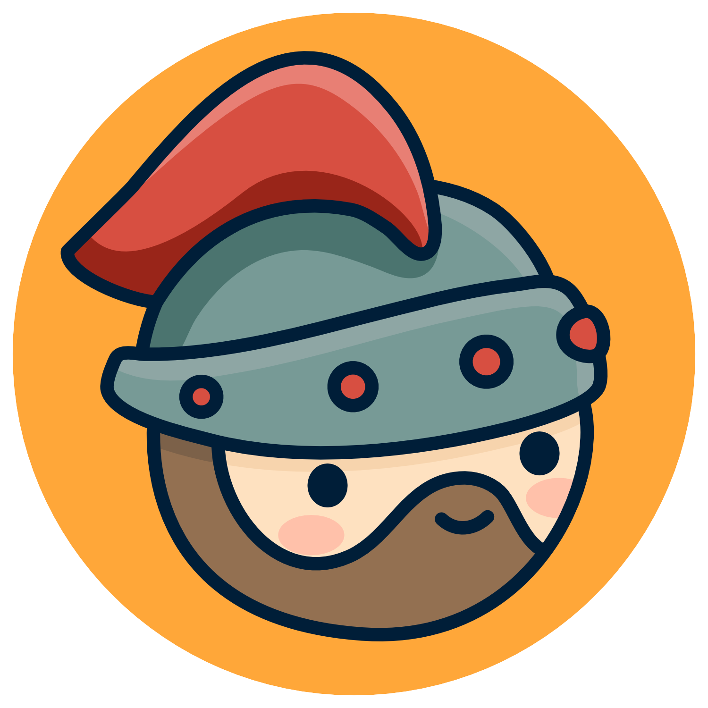

# Projetos de pesquisa e de desenvolvimento

## Orion Services

O Orion Services são um conjunto de serviços de código [(Apache 2.0)](https://www.apache.org/licenses/LICENSE-2.0) aberto destinados para apoiar a prototipação e o desenvolvimento de sistemas educacionais colaborativos. Alguns exemplos de serviços: [Orion Users](https://github.com/orion-services/users) - um serviço de autenticação de ususários e [Orion Talk](https://github.com/orion-services/talk) - um serviço de troca de mensagens síncrona e assíncrona.
{: .fs-3 }

* [Página](https://orion-services.dev) do projeto
{: .fs-3 }

* Fale com a equipe no [Discord](https://discord.gg/XpyGTZPApN)
{: .fs-3 }

## Xô Dengue

O “Xô Dengue” é um jogo educacional colaborativo aberto [(Apache 2.0)](https://www.apache.org/licenses/LICENSE-2.0) de tabuleiro cujo objetivo principal é ensinar sobre a importância de combater a proliferação do mosquito transmissor da dengue o Aedes aegypti.
{: .fs-3 }

* [Página do jogo](https://rodrigoprestesmachado.github.io/xodengue/)
{: .fs-3 }