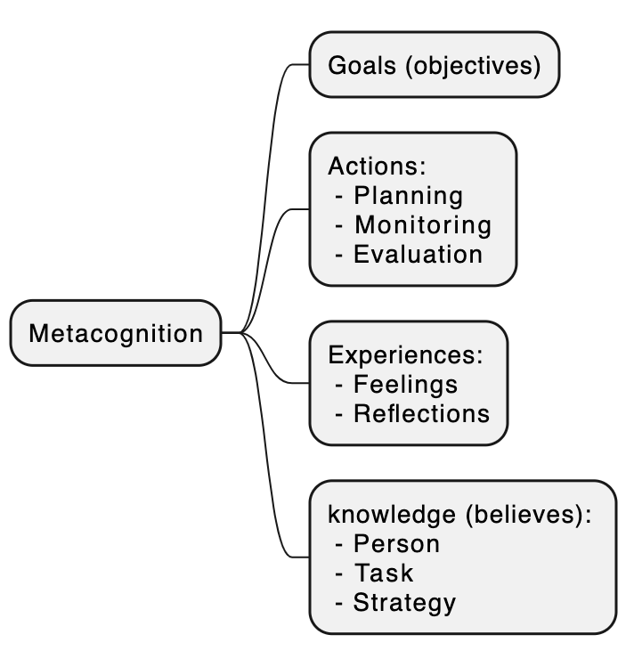
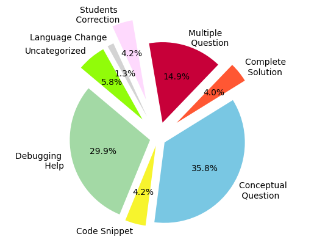
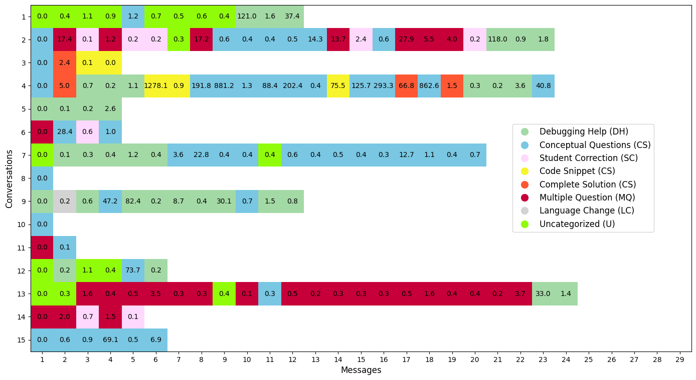
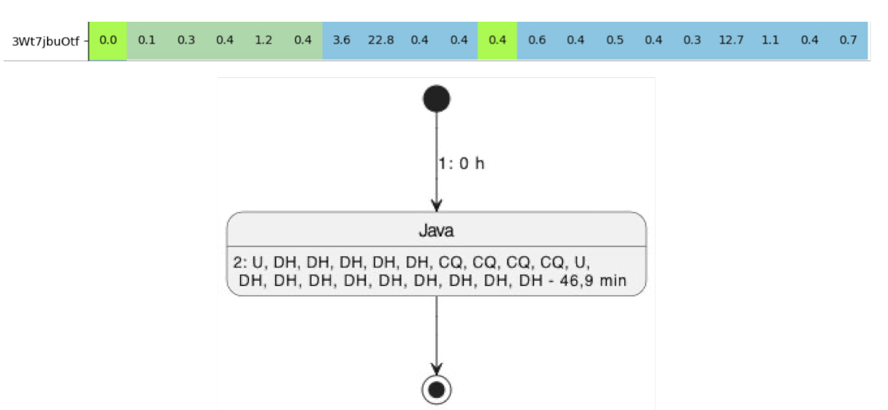
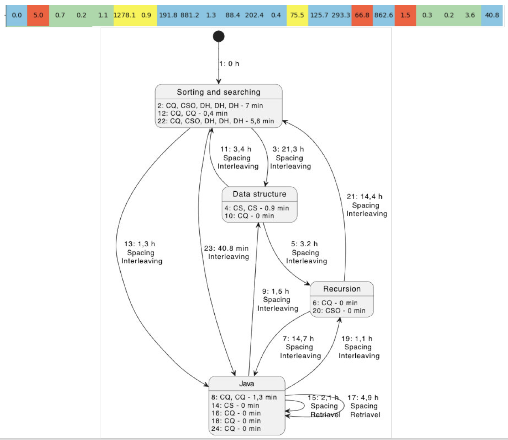
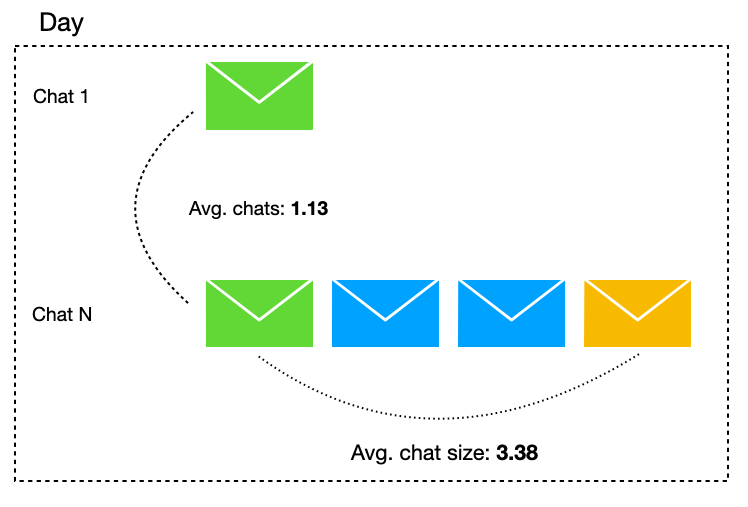

<!-- .slide: data-background-opacity="0.1" data-background-image="img/title.jpg" data-transition="convex" -->
# Analyzing Student Use of Metacognition Strategies in Interactions with GenAI-Powered Chatbots
<!-- .element: style="margin-bottom:120px; font-size: 35px; color:white; font-family: Comic Sans MS;" -->

Rodrigo Prestes Machado
<!-- .element: style="margin-bottom:10px; font-size: 24px; color:white; font-family:Optima;" -->

rprestes@it.uc3m.es
<!-- .element: style="margin-bottom:10px; font-size: 24px; color:white; font-family:Optima;" -->

rodrigo.prestes@poa.ifrs.edu.br
<!-- .element: style="margin-bottom:10px; font-size: 24px; color:white; font-family:Optima;" -->

Press 'F' to full screen
<!-- .element: style="margin-bottom:10px; font-size: 15px; color:white; font-family:Optima;" -->

[pdf version](?print-pdf)
<!-- .element: style="margin-bottom 35px; font-size: 15px; color:white; font-family:Optima;" -->

<!-- .slide: data-background="#273050" data-transition="convex" -->
# Rodrigo Prestes Machado
<!-- .element: style="margin-bottom:110px; font-size: 40px; color:white; font-family: Comic Sans MS;" -->

* Professor of Computer Science at IFRS - Porto Alegre, Brazil
<!-- .element: style="margin-bottom:100px; font-size: 36px; color:white; font-family:Optima;" -->

* Postdoctoral Researcher at UC3M
<!-- .element: style="margin-bottom:40px; font-size: 36px; color:white; font-family:Optima;" -->

<!-- .slide: data-background="#64C780" data-transition="convex" -->
# Introduction
<!-- .element: style="margin-bottom:80px; font-size: 40px; color:black; font-family: Comic Sans MS;" -->

<!-- .slide: data-background="#273050" data-transition="convex" -->
# GenAI: Some Potential Benefits
<!-- .element: style="margin-bottom:50px; font-size: 40px; color:white; font-family: Comic Sans MS;" -->

* Effective learning with ChatGPT (Lo et al., 2024).
<!-- .element: style="margin-bottom:40px; font-size: 28px; color:white; font-family:Optima;" -->

* Improvements in comprehension  (Callejo et al., 2024).
<!-- .element: style="margin-bottom:40px; font-size: 28px; color:white; font-family:Optima;" -->

* Positive attitudes in using GenAI (Chan & Hu, 2023).
<!-- .element: style="margin-bottom:40px; font-size: 28px; color:white; font-family:Optima;" -->

* Regulate their learning pace (Xia et al., 2023).
<!-- .element: style="margin-bottom:40px; font-size: 28px; color:white; font-family:Optima;" -->

<!-- .slide: data-background="#914322" data-transition="convex" -->
# GenAI: Some Potential Risks
<!-- .element: style="margin-bottom:50px; font-size: 40px; color:white; font-family: Comic Sans MS;" -->

* Excessive reliance on the tool  (Vargas-Murillo et al., 2023).
<!-- .element: style="margin-bottom:40px; font-size: 28px; color:white; font-family:Optima;" -->

* Overdependence may reduce critical thinking (Chan & Hu, 2023).
<!-- .element: style="margin-bottom:40px; font-size: 28px; color:white; font-family:Optima;" -->

* Drop 17% in retention (Bastani et al., 2024).
<!-- .element: style="margin-bottom:40px; font-size: 28px; color:white; font-family:Optima;" -->

* No significant advantage without a structured approach (Sun et al., 2024).
<!-- .element: style="margin-bottom:40px; font-size: 28px; color:white; font-family:Optima;" -->

<!-- .slide: data-background="#273050" data-transition="convex" -->
# Research Questions
<!-- .element: style="margin-bottom:30px; font-size: 40px; color:white; font-family: Optima;" -->

  

  

    <ul style="color: #fff; font-size: 26px; text-shadow: 1px 1px 8px #222, 0 0 2px #000; list-style-type: disc; margin: 0; padding-left: 20px;">
      <li style="margin-bottom: 100px; font-weight: bold;">How can educators design structured uses of GenAI that enhance learning without compromising critical thinking and academic outcomes?
        <ul style="font-size: 22px; list-style-type: circle; margin-top: 28px; padding-left: 24px;">
          <li style="margin-bottom: 70px; font-weight: normal;">How are students currently using Generative AI tools in their learning processes?</li>
          <li style="font-weight: normal;">What structured strategies for using GenAI lead to better learning outcomes?</li>
        </ul>
      </li>
    </ul>
  

<!-- .slide: data-background="#64C780" data-transition="convex" -->
# How are students currently using Generative AI tools in their learning processes?
<!-- .element: style="margin-bottom:80px; font-size: 38px; color:black; font-family: Comic Sans MS;" -->

<!-- .slide: data-background="#273050" data-transition="convex" -->
# How are students currently using Generative AI tools in their learning processes?
<!-- .element: style="margin-bottom:80px; font-size: 32px; color:white; font-family: Comic Sans MS;" -->

* Analysis of Student Interaction Logs with Chatbots powered by GenAI with the Retrieval Augmented Generation (RAG) technique.
<!-- .element: style="margin-bottom:20px; font-size: 32px; color:white; font-family:Optima;" -->

  * UC3M (Java programming)
  <!-- .element: style="margin-bottom:10px; font-size: 24px; color:white; font-family:Optima;" -->
  * IPLACEX from Chile (several areas)
  <!-- .element: style="margin-bottom:60px; font-size: 24px; color:white; font-family:Optima;" -->

* We chose Metacognition theory to analyze students' interactions.
<!-- .element: style="margin-bottom:40px; font-size: 30px; color:white; font-family:Optima;" -->

<!-- .slide: data-background="#FFFFFF" data-transition="convex" -->
# Metacognition (Flavell)
<!-- .element: style="margin-bottom:50px; font-size: 40px; color:black; font-family: Comic Sans MS;" -->

<!-- .slide: data-background="#273050" data-transition="convex" -->
# Metacognition Actions at UC3M Chatbot in 2024
<!-- .element: style="margin-bottom:80px; font-size: 32px; color:white; font-family: Comic Sans MS;" -->

* Interleaved Practice - Mixing different kinds of problems or topics within a single study session.
<!-- .element: style="margin-bottom:30px; font-size: 28px; color:white; font-family:Optima;" -->

  * Messages are classified by intention (e.g., code snippet) and topic (e.g., data structures).
<!-- .element: style="margin-bottom:80px; font-size: 22px; color:white; font-family:Optima;" -->

* Spaced Practice - Implementing a schedule of practice that spreads study activities out over time.
<!-- .element: style="margin-bottom:30px; font-size: 28px; color:white; font-family:Optima;" -->

  * Message time deltas were calculated (spacing > 60').
<!-- .element: style="margin-bottom:100px; font-size: 22px; color:white; font-family:Optima;" -->

<!-- .slide: data-background="#FFFFFF" data-transition="convex" -->
# UC3M Chatbot in 2024
<!-- .element: style="margin-bottom:50px; font-size: 40px; color:black; font-family: Comic Sans MS;" -->

<!-- .slide: data-background="#FFFFFF" data-transition="convex" -->
# UC3M Chatbot in 2024
<!-- .element: style="margin-bottom:50px; font-size: 40px; color:black; font-family: Comic Sans MS;" -->

<!-- .slide: data-background="#FFFFFF" data-transition="convex" -->
# UC3M Chatbot in 2024
<!-- .element: style="margin-bottom:50px; font-size: 40px; color:black; font-family: Comic Sans MS;" -->

<!-- .slide: data-background="#FFFFFF" data-transition="convex" -->
# UC3M Chatbot in 2024
<!-- .element: style="margin-bottom:30px; font-size: 40px; color:black; font-family: Comic Sans MS;" -->

<!-- .slide: data-background="#273050" data-transition="convex" -->
# UC3M 2024: Results and Conclusion
<!-- .element: style="margin-bottom:50px; font-size: 32px; color:white; font-family: Comic Sans MS;" -->

* Conversations averaged 7.72 messages each.
<!-- .element: style="margin-bottom:30px; font-size: 28px; color:white; font-family:Optima;" -->

* 34% of conversations showed evidence of spacing, with 84.2% involving a topic change.
<!-- .element: style="margin-bottom:30px; font-size: 28px; color:white; font-family:Optima;" -->

* Blocked study sessions contained an average of 4.18 messages.
<!-- .element: style="margin-bottom:30px; font-size: 28px; color:white; font-family:Optima;" -->

* 8.8% of conversations demonstrated potential use of interleaving by students.
<!-- .element: style="margin-bottom:30px; font-size: 28px; color:white; font-family:Optima;" -->

* Interactions in the Code Snippets and Multiple Choose Question (Quiz) categories stood out for their delta consistently small.
<!-- .element: style="margin-bottom:30px; font-size: 28px; color:white; font-family:Optima;" -->

* **Conclusion:** an intentional application of learning strategies like spacing and interleaving exists but remains limited.
<!-- .element: style="margin-bottom:30px; font-size: 28px; color:white; font-family:Optima;" -->

<!-- .slide: data-background="#273050" data-transition="convex" -->
# IPLACEX 2025: Preliminary Results
<!-- .element: style="margin-bottom:50px; font-size: 32px; color:white; font-family: Comic Sans MS;" -->

<!-- .slide: data-background="#FFFF" data-transition="convex" -->
<!-- .element: style="margin-bottom:20px; font-size: 38px; color:black; font-family: Comic Sans MS;" -->

<!-- .slide: data-background="#FFFF" data-transition="convex" -->
<!-- .element: style="margin-bottom:20px; font-size: 38px; color:black; font-family: Comic Sans MS;" -->

<!-- .slide: data-background="#FFFF" data-transition="convex" -->
<!-- .element: style="margin-bottom:20px; font-size: 38px; color:black; font-family: Comic Sans MS;" -->

<!-- .slide: data-background="#273050" data-transition="convex" -->
# IPLACEX 2025: Preliminary Results
<!-- .element: style="margin-bottom:50px; font-size: 32px; color:white; font-family: Comic Sans MS;" -->

* Average number of messages per conversation:
<!-- .element: style="margin-bottom:30px; font-size: 28px; color:white; font-family:Optima;" -->

  * IPLACEX: 3.38 (after removing single-message chats)
<!-- .element: style="margin-bottom:30px; font-size: 28px; color:white; font-family:Optima;" -->

  * UC3M (2024 - 2025): 7.72 - 5.21
<!-- .element: style="margin-bottom:70px; font-size: 28px; color:white; font-family:Optima;" -->

* At IPLACEX, the majority of courses are delivered online.
<!-- .element: style="margin-bottom:50px; font-size: 28px; color:white; font-family:Optima;" -->

<!-- .slide: data-background="#64C780" data-transition="convex" -->
# What structured strategies for using GenAI lead to better learning outcomes?
<!-- .element: style="margin-bottom:80px; font-size: 40px; color:black; font-family: Comic Sans MS;" -->

<!-- .slide: data-background="#273050" data-transition="convex" -->
# Next Investigations
<!-- .element: style="margin-bottom:50px; font-size: 32px; color:white; font-family: Comic Sans MS;" -->

* Modify student tasks to include metacognitive prompt ideas that support
  planning, monitoring, and evaluation.
<!-- .element: style="margin-bottom:80px; font-size: 28px; color:white; font-family:Optima;" -->

* Evaluate the task modifications to determine their impact on:
<!-- .element: style="margin-bottom:20px; font-size: 28px; color:white; font-family:Optima;" -->
 * Usage patterns,
<!-- .element: style="margin-bottom:20px; font-size: 28px; color:white; font-family:Optima;" -->
 * Metacognitive experiences (emotions),
<!-- .element: style="margin-bottom:20px; font-size: 28px; color:white; font-family:Optima;" -->
 * Academic performance.
<!-- .element: style="margin-bottom:20px; font-size: 28px; color:white; font-family:Optima;" -->

<!-- .slide: data-background="#64C780" data-transition="convex" -->
# Thank you!
<!-- .element: style="margin-bottom:90px; font-size: 38px; color:black; font-family: Comic Sans MS;" -->

<a href="mailto:rprestes@it.uc3m.es" style="color:black; font-size: 30px; font-family:Optima; margin-bottom:5px; display:inline-block;">rprestes@it.uc3m.es</a>

<a href="mailto:rodrigo.prestes@poa.ifrs.edu.br
" style="color:black; font-size: 30px; font-family:Optima; margin-bottom:5px; display:inline-block;">rodrigo.prestes@poa.ifrs.edu.br</a>

<a href="https://rpmhub.dev" style="color:black; font-size: 5px; font-family:Optima; margin-bottom:10px; display:inline-block;">https://rpmhub.dev</a>
