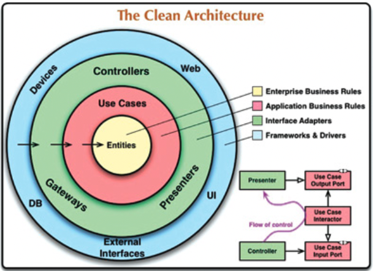

<!-- .slide:  data-background-opacity="0.1" data-background-image="https://wallpaperaccess.com/full/22038.jpg"
data-transition="convex"  -->
# Flower
<!-- .element: style="margin-bottom:100px; font-size: 50px; color:white; font-family: Marker Felt;" -->

Pressione 'F' para tela cheia
<!-- .element: style="font-size: small; color:white;" -->

[versão em pdf](?print-pdf)
<!-- .element: style="font-size: small;" -->

<!-- .slide: data-background="#180138" data-transition="convex"  -->
## Processo de desenvolvimento (devops)
<!-- .element: style="margin-bottom:50px; font-size: 40px; font-family: Marker Felt; color:#F5F5F5" -->

<a href="http://www.plantuml.com/plantuml/proxy?cache=no&src=https://raw.githubusercontent.com/rodrigoprestesmachado/web/dev/docs/slides/devops.puml">
  
</a>

<!-- .slide: data-background="#180138" data-transition="convex"  -->
## Meetings
<!-- .element: style="margin-bottom:50px; font-size: 40px; font-family: Marker Felt; color:#F5F5F5" -->

* Quinzenais - captura de requisitos e entrega de funcionalidades (Ana e Cris)
<!-- .element: style="margin-bottom:50px; font-size: 23px; font-family: arial; color:#F5F5F5" -->

* Diárias - duração rápida apenas para verificar o andamento e se alguém necessita de ajuda (scrum meeting)
<!-- .element: style="margin-bottom:50px; font-size: 23px; font-family: arial; color:#F5F5F5" -->

* Encontros "presenciais" - duas vezes por semana com o objetivo de treinamento e codificação das tarefas
<!-- .element: style="margin-bottom:50px; font-size: 23px; font-family: arial; color:#F5F5F5" -->

<!-- .slide: data-background="#180138" data-transition="convex"  -->
## Arquitetura
<!-- .element: style="margin-bottom:50px; font-size: 40px; font-family: Marker Felt; color:#F5F5F5" -->

<a href="http://www.plantuml.com/plantuml/proxy?cache=no&src=https://raw.githubusercontent.com/rodrigoprestesmachado/web/dev/docs/slides/arquitetura.puml">
  
</a>

<!-- .slide: data-background="#180138" data-transition="convex"  -->
## Arquitetura interna dos componentes
<!-- .element: style="margin-bottom:50px; font-size: 40px; font-family: Marker Felt; color:#F5F5F5" -->

<!-- .element: style="height: 400px; margin-top: 50px" -->

