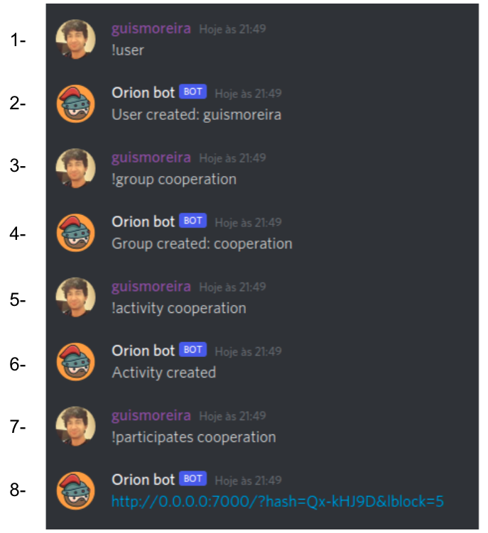
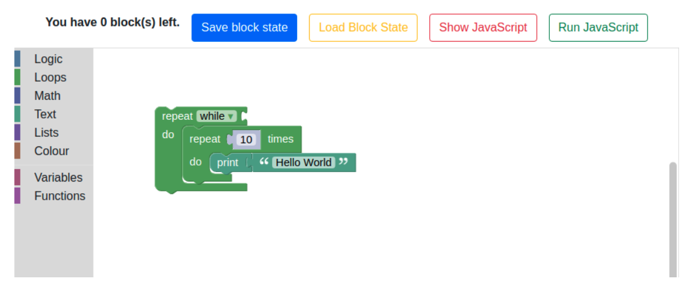
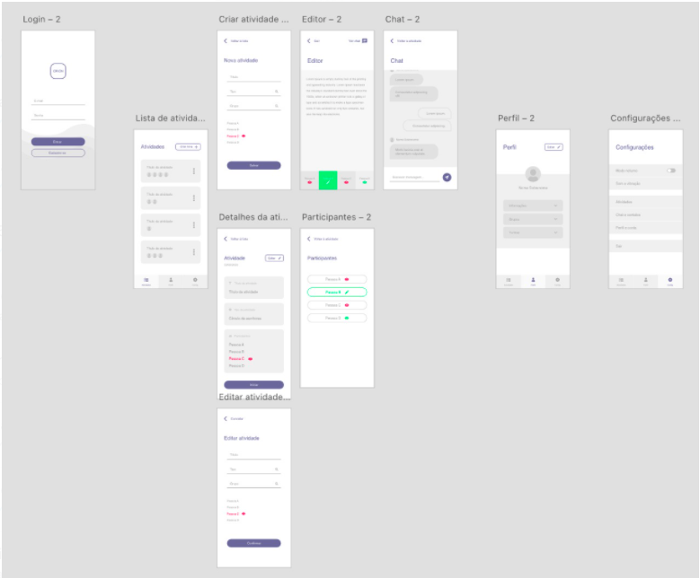
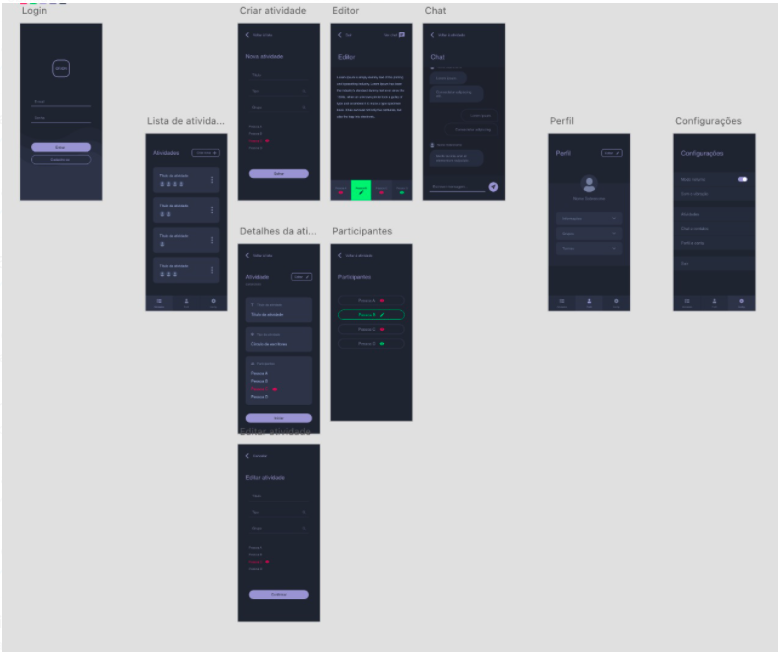
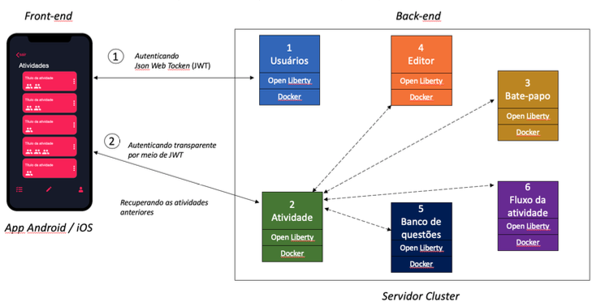
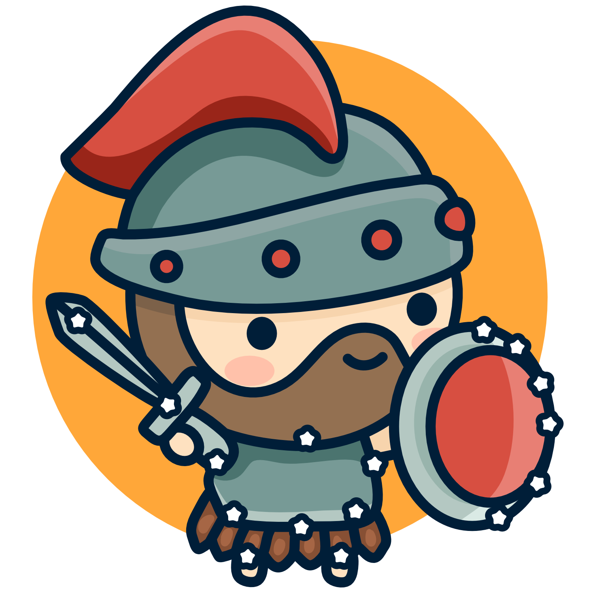
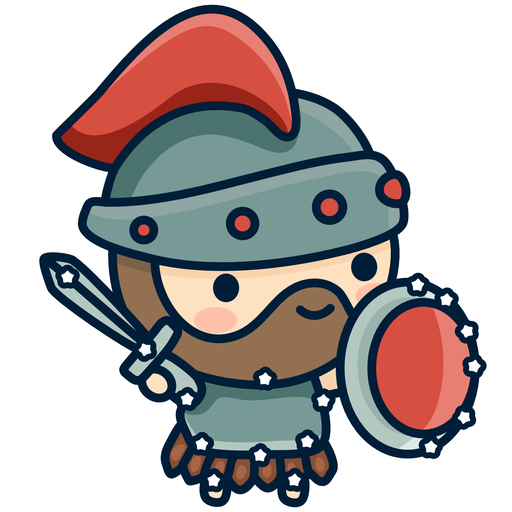
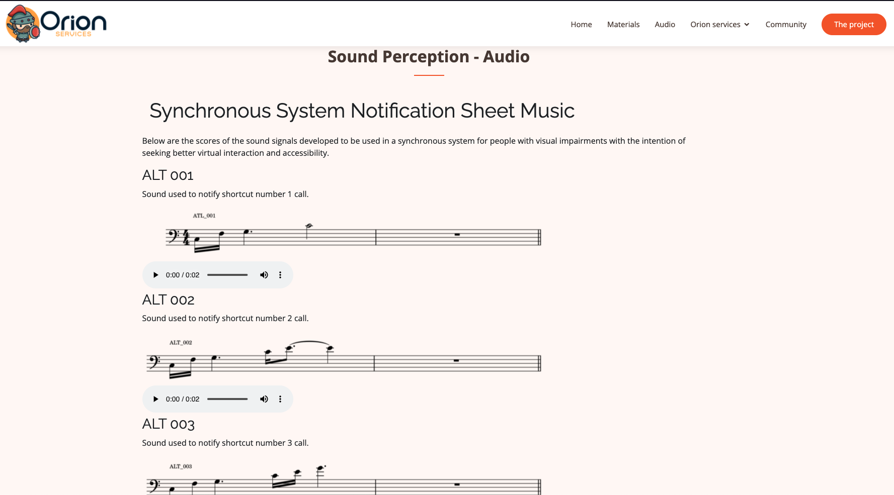

<!-- .slide:  data-background-opacity="0.1" data-background-image="https://media.itpro.co.uk/image/upload/v1570816546/itpro/2019/02/software_shutterstock_1290773869.jpg" 
data-transition="convex"  -->
# Protótipos 🚀
<!-- .element: style="margin-bottom:100px; font-size: 50px; color:white; font-family: Marker Felt;" -->

Pressione 'F' para tela cheia
<!-- .element: style="font-size: small; color:white;" -->

[versão em pdf](?print-pdf)
<!-- .element: style="font-size: small;" -->

<!-- .slide: data-background="#185449" data-transition="convex"  -->
## Cooperação em programação, matemática e escrita
<!-- .element: style="margin-bottom:50px; font-size: 40px; font-family: Marker Felt; color:#F5F5F5" -->

* Implementa um fluxo de atividades cooperativas chamado círculo de escritores
<!-- .element: style="margin-bottom:50px; font-size: 23px; font-family: arial; color:#F5F5F5" -->

* Neste fluxo, cada estudante deve continuar a resolução de um problema (programação, matemática, etc.) de onde um colega parou
<!-- .element: style="margin-bottom:50px; font-size: 23px; font-family: arial; color:#F5F5F5" -->

* Atualmente temos protótipos desse tipo de atividade baseado em atividade conversacional no Discord e também apps (PWA)
<!-- .element: style="margin-bottom:50px; font-size: 23px; font-family: arial; color:#F5F5F5" -->

<!-- .slide: data-background="#185449" data-transition="convex"  -->
## Interface conversacional Discord
<!-- .element: style="margin-bottom:50px; font-size: 40px; font-family: Marker Felt; color:#F5F5F5" -->

<!-- .slide: data-background="#185449" data-transition="convex"  -->
## Interface conversacional Discord
<!-- .element: style="margin-bottom:50px; font-size: 40px; font-family: Marker Felt; color:#F5F5F5" -->

<!-- .element: style="height: 400px; margin-top: 50px" -->

<!-- .slide: data-background="#185449" data-transition="convex"  -->
## Interface conversacional Discord
<!-- .element: style="margin-bottom:50px; font-size: 40px; font-family: Marker Felt; color:#F5F5F5" -->

<!-- .element: style="height: 400px; margin-top: 50px" -->

<!-- .slide: data-background="#185449" data-transition="convex"  -->
## Interface web (pwa)
<!-- .element: style="margin-bottom:50px; font-size: 40px; font-family: Marker Felt; color:#F5F5F5" -->

<!-- .slide: data-background="#185449" data-transition="convex"  -->
## Interface web (pwa)
<!-- .element: style="margin-bottom:50px; font-size: 40px; font-family: Marker Felt; color:#F5F5F5" -->

<!-- .element: style="height: 500px; margin-top: 50px" -->

<!-- .slide: data-background="#185449" data-transition="convex"  -->
## Interface web (pwa)
<!-- .element: style="margin-bottom:50px; font-size: 40px; font-family: Marker Felt; color:#F5F5F5" -->

<!-- .element: style="height: 500px; margin-top: 50px" -->

<!-- .slide: data-background="#185449" data-transition="convex"  -->
## Escalabilidade
<!-- .element: style="margin-bottom:50px; font-size: 40px; font-family: Marker Felt; color:#F5F5F5" -->

<!-- .slide: data-background="#185449" data-transition="convex"  -->
## Escalabilidade
<!-- .element: style="margin-bottom:50px; font-size: 40px; font-family: Marker Felt; color:#F5F5F5" -->

<!-- .element: style="height: 400px; margin-top: 50px" -->

<!-- .slide: data-background="#185449" data-transition="convex"  -->
## Marca
<!-- .element: style="margin-bottom:50px; font-size: 40px; font-family: Marker Felt; color:#F5F5F5" -->

<!-- .slide: data-background="#185449" data-transition="convex"  -->
## Marca
<!-- .element: style="margin-bottom:50px; font-size: 40px; font-family: Marker Felt; color:#F5F5F5" -->

<!-- .element: style="height: 400px; margin-top: 0px; background-color: #F2FAF3;" -->

<!-- .slide: data-background="#185449" data-transition="convex"  -->
## Marca
<!-- .element: style="margin-bottom:50px; font-size: 40px; font-family: Marker Felt; color:#F5F5F5" -->

<!-- .element: style="height: 400px; margin-top: 0px; background-color: #F2FAF3;" -->

<!-- .slide: data-background="#185449" data-transition="convex"  -->
## Marca
<!-- .element: style="margin-bottom:50px; font-size: 40px; font-family: Marker Felt; color:#F5F5F5" -->

<!-- .element: style="height: 400px; margin-top: 0px; background-color: #F2FAF3;" -->

<!-- .slide: data-background="#185449" data-transition="convex"  -->
## Acessibilidade
<!-- .element: style="margin-bottom:50px; font-size: 40px; font-family: Marker Felt; color:#F5F5F5" -->

<!-- .slide: data-background="#185449" data-transition="convex"  -->
## Acessibilidade
<!-- .element: style="margin-bottom:50px; font-size: 40px; font-family: Marker Felt; color:#F5F5F5" -->

* Desenvolvimento de um conjunto de sons para notificar estudantes cegos sobre a ação dos outros no espaço compartilhado
<!-- .element: style="margin-bottom:30px; font-size: 23px; font-family: arial; color:#F5F5F5" -->

<!-- .element: style="height: 400px; margin-top: 50px" -->