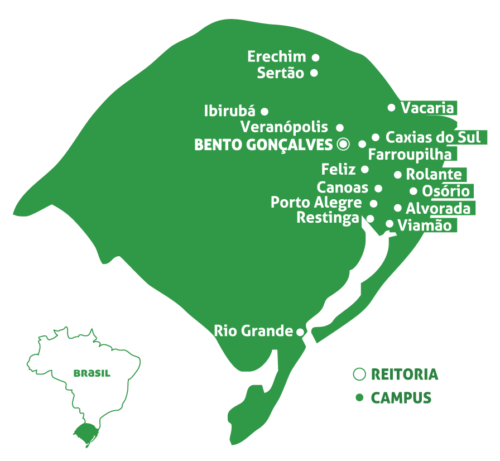

<!-- .slide: data-background-opacity="0.3" data-background-image="img/title.jpg" data-transition="convex" -->
# Rodrigo Prestes Machado
<!-- .element: style="margin-bottom:100px; font-size: 60px; color:white; font-family: Marker Felt;" -->

Pressione 'F' para tela cheia
<!-- .element: style="margin-bottom:10px; font-size: 15px; color:white" -->

[versão em pdf](?print-pdf)
<!-- .element: style="margin-bottom 25px; font-size: 15px; color:white" -->

<!-- .slide: data-background="#697690" data-transition="convex" -->
# Instituto Federal do Rio Grande do Sul (IFRS)
<!-- .element: style="margin-bottom:50px; font-size: 50px; color:white; font-family: Marker Felt;" -->

<!-- .slide: data-background="#697690" data-transition="convex" -->
## Overview
<!-- .element: style="margin-bottom:50px; font-size: 50px; color:white; font-family: Marker Felt;" -->

* **Established**: 2008
<!-- .element: style="margin-bottom:70px; font-size: 25px; color:white" -->

* **Programs Offered**: Technical courses, undergraduate degrees, and postgraduate studies
<!-- .element: style="margin-bottom:70px; font-size: 25px; color:white" -->

* **Headquarters**: Bento Gonçalves
<!-- .element: style="margin-bottom:70px; font-size: 25px; color:white" -->

* **Campuses**: 17 locations across Rio Grande do Sul
<!-- .element: style="margin-bottom:70px; font-size: 25px; color:white" -->

<!-- .slide: data-background="white" data-transition="convex" -->
## IFRS
<!-- .element: style="margin-bottom:50px; font-size: 50px; color:black; font-family: Marker Felt;" -->

 <!-- .element height="50%" width="50%" -->

<!-- .slide: data-background="#697690" data-transition="convex" -->
## IFRS by the Numbers
<!-- .element: style="margin-bottom:50px; font-size: 50px; color:white; font-family: Marker Felt;" -->

* **Students**: Approximately 26,000
<!-- .element: style="margin-bottom:70px; font-size: 25px; color:white" -->

* **Professors**: Around 1,000
<!-- .element: style="margin-bottom:70px; font-size: 25px; color:white" -->

* **Administrative Staff**: About 800
<!-- .element: style="margin-bottom:70px; font-size: 25px; color:white" -->

<!-- .slide: data-background="#697690" data-transition="convex" -->
# Projects
<!-- .element: style="margin-bottom:50px; font-size: 50px; color:white; font-family: Marker Felt;" -->

<!-- .slide: data-background="#697690" data-transition="convex" -->
## High Drop-Out Rates
<!-- .element: style="margin-bottom:50px; font-size: 50px; color:white; font-family: Marker Felt;" -->

* Many learners do not complete their courses.
<!-- .element: style="margin-bottom:70px; font-size: 25px; color:white" -->

* Key factor: Lack of social interaction (Aldowah et al., 2019).
<!-- .element: style="margin-bottom:70px; font-size: 25px; color:white" -->

<!-- .slide: data-background="#697690" data-transition="convex" -->
## Cooperative Learning
<!-- .element: style="margin-bottom:50px; font-size: 50px; color:white; font-family: Marker Felt;" -->

* Cooperative Learning has proven effective in enhancing learner engagement and
improving knowledge retention in online courses.
<!-- .element: style="margin-bottom:50px; font-size: 25px; color:white" -->

  * Enhances students' critical thinking skills and problem-solving abilities.
  <!-- .element: style="margin-bottom:50px; font-size: 25px; color:white" -->

  * Promotes a deeper understanding of course content.
  <!-- .element: style="margin-bottom:50px; font-size: 25px; color:white" -->

  * Develops interactive abilities with self, others, society, and nature.
  <!-- .element: style="margin-bottom:50px; font-size: 25px; color:white" -->

  * Promotes reciprocity and common good.
  <!-- .element: style="margin-bottom:50px; font-size: 25px; color:white" -->

<!-- .slide: data-background="#697690" data-transition="convex" -->
### AI and Cooperative Learning applying in MOOCs
<!-- .element: style="margin-bottom:50px; font-size: 45px; color:white; font-family: Marker Felt;" -->

* **Group Coordination**: A chatbot could apply Cooperative Learning pedagogical
principles to coordinate group formation.
<!-- .element: style="margin-bottom:70px; font-size: 25px; color:white" -->

* **Progress Monitoring**: AI can monitor progress and provide personalized
feedback and guidance.
<!-- .element: style="margin-bottom:70px; font-size: 25px; color:white" -->

* **Facilitating Learning**: AI can play the role of a student in a group,
facilitating the learning process through appropriate interventions when forming
groups is challenging.
<!-- .element: style="margin-bottom:70px; font-size: 25px; color:white" -->

<!-- .slide: data-background="#697690" data-transition="convex" -->
# Referências 📚
<!-- .element: style="margin-bottom:50px; font-size: 50px; color:white; font-family: Marker Felt;" -->

* Using Opentracing. Disponível em: [https://quarkus.io/guides/opentracing](https://quarkus.io/guides/opentracing)
<!-- .element: style="margin-bottom:40px; font-size: 20px; color:white" -->

* Centralized Log Management. Disponível em: [https://quarkus.io/guides/centralized-log-management](https://quarkus.io/guides/centralized-log-management)
<!-- .element: style="margin-bottom:40px; font-size: 20px; color:white" -->

* Jaeger. Disponível em: [https://www.jaegertracing.io](https://www.jaegertracing.io)
<!-- .element: style="margin-bottom:40px; font-size: 20px; color:white" -->

* GrayLog. Disponível em: [https://www.graylog.org](https://www.graylog.org)
<!-- .element: style="margin-bottom:40px; font-size: 20px; color:white" -->
