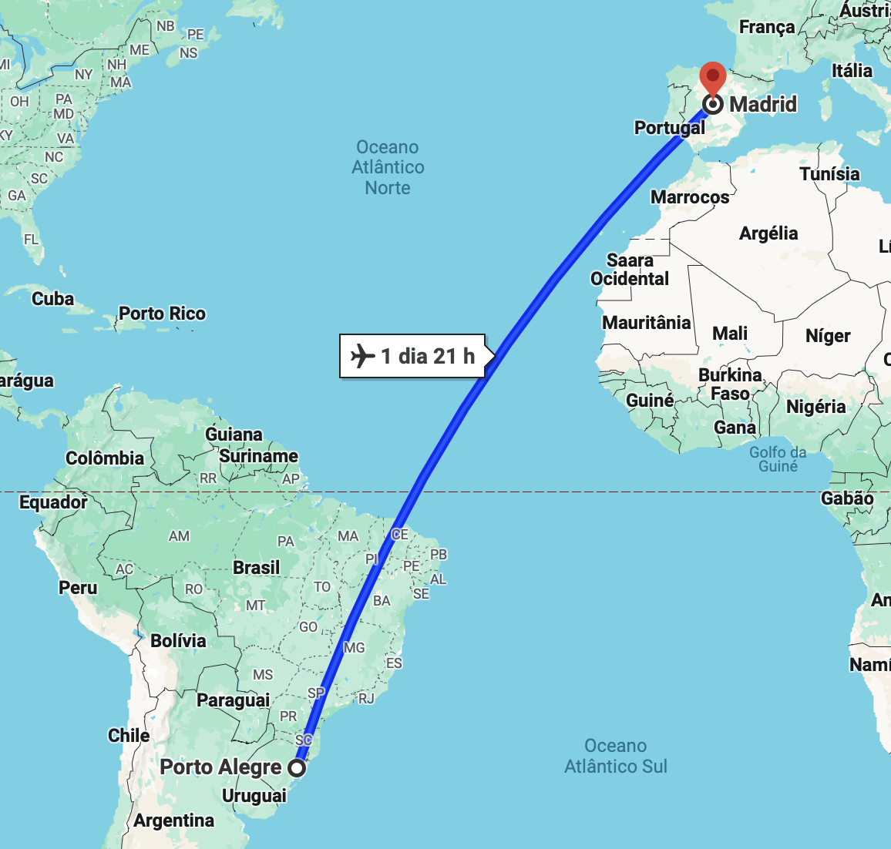

<!-- .slide: data-background-opacity="0.3" data-background-image="img/title.jpg" data-transition="convex" -->
# Rodrigo Prestes Machado
<!-- .element: style="margin-bottom:10px; font-size: 60px; color:white; font-family: Comic Sans MS;" -->

Instituto Federal do Rio Grande do Sul (IFRS)
<!-- .element: style="margin-bottom:10px; font-size: 30px; color:white; font-family:Optima;" -->

rodrigo.prestes@poa.ifrs.edu.br
<!-- .element: style="margin-bottom:100px; font-size: 30px; color:white; font-family:Optima;" -->

Press 'F' to full screen
<!-- .element: style="margin-bottom:10px; font-size: 15px; color:white; font-family:Optima;" -->

[pdf version](?print-pdf)
<!-- .element: style="margin-bottom 35px; font-size: 15px; color:white; font-family:Optima;" -->

<!-- .slide: data-background="#B1F05D" data-transition="convex" -->
## First: some presentation
<!-- .element: style="margin-bottom:20px; font-size: 40px; color:black; font-family: Comic Sans MS;" -->

<!-- .slide: data-background="#495575" data-transition="concave" -->

 <!-- .element height="60%" width="60%" -->

<!-- .slide: data-background="#495575" data-transition="convex" -->
## Porto Alegre
<!-- .element: style="margin-bottom:60px; font-size: 55px; color:white; font-family: Comic Sans MS;" -->

* Porto Alegre is the capital of the state of Rio Grande do Sul, Brazil.
<!-- .element: style="margin-bottom:75px; font-size: 35px; color:white; font-family:Optima;" -->

* It is a large city in the south of Brazil with  1.5 million inhabitants.
<!-- .element: style="margin-bottom:75px; font-size: 35px; color:white; font-family:Optima;" -->

* The metropolitan area has 34 municipalities and is around 4.5 million inhabitants.
<!-- .element: style="margin-bottom:75px; font-size: 35px; color:white; font-family:Optima;" -->

<!-- .slide: data-background-opacity="0.9" data-background-image="img/poa.png" data-transition="slide" -->
## Porto Alegre
<!-- .element: style="margin-bottom:100px; font-size: 40px; color:white; font-family: Comic Sans MS;" -->

<!-- .slide: data-background-opacity="0.3" data-transition="concave" data-background-image="img/ifrspoa.jpg" -->
## Instituto Federal do Rio Grande do Sul (IFRS)
<!-- .element: style="margin-bottom:50px; font-size: 40px; color:white; font-family: Comic Sans MS;" -->

<!-- .slide: data-background="#495575" data-transition="convex" -->
## IFRS Overview
<!-- .element: style="margin-bottom:50px; font-size: 50px; color:white; font-family: Comic Sans MS;" -->

* Established in 2008
<!-- .element: style="margin-bottom:70px; font-size: 40px; color:white; font-family:Optima;" -->

* 17 campuses across Rio Grande do Sul
<!-- .element: style="margin-bottom:70px; font-size: 40px; color:white; font-family:Optima;" -->

* Offers technical courses, undergraduate degrees, and postgraduate studies
<!-- .element: style="margin-bottom:70px; font-size: 40px; color:white; font-family:Optima;" -->

<!-- .slide: data-background="#093B09" data-transition="convex" -->
## IFRS Campuses
<!-- .element: style="margin-bottom:5px; font-size: 40px; color:white; font-family: Comic Sans MS;" -->

 <!-- .element: style="height: 60%; width: 60%; background-color: white" -->

<!-- .slide: data-background="#495575" data-transition="convex" -->
## IFRS Community
<!-- .element: style="margin-bottom:50px; font-size: 50px; color:white; font-family: Comic Sans MS;" -->

* Approximately **26000** students
<!-- .element: style="margin-bottom:70px; font-size: 40px; color:white; font-family:Optima;" -->

* Around **1000** professors
<!-- .element: style="margin-bottom:70px; font-size: 40px; color:white; font-family:Optima;" -->

* About **800** administrative staff
<!-- .element: style="margin-bottom:70px; font-size: 40px; color:white; font-family:Optima;" -->

<!-- .slide: data-background="#B1F05D" data-transition="convex" -->
## Projects
<!-- .element: style="margin-bottom:50px; font-size: 40px; color:black; font-family: Comic Sans MS;" -->

<!-- .slide: data-background="#B1F05D" data-transition="convex" -->
## 1. Sound awareness in synchronous and cooperative learning applications for people with visual impairments
<!-- .element: style="margin-bottom:50px; font-size: 35px; color:black; font-family: Comic Sans MS;" -->

<!-- .slide: data-background="#495575" data-transition="convex" -->
## Sound awareness in synchronous and cooperative learning applications for people with visual impairments
<!-- .element: style="margin-bottom:50px; font-size: 35px; color:white; font-family: Comic Sans MS;" -->

* **Problem:** People with visual impairments face challenges in synchronous applications.
<!-- .element: style="margin-bottom:30px; font-size: 35px; color:white; font-family:Optima;" -->
  * Examples: Who enters the room? Who changes the document? Who sends a message?
<!-- .element: style="margin-bottom:70px; font-size: 25px; color:white; font-family:Optima;" -->

* **Objective:** Develop a sound awareness system to support people with visual impairments in synchronous and cooperative learning applications.
<!-- .element: style="margin-bottom:70px; font-size: 30px; color:white; font-family:Optima;" -->

<!-- .slide: data-background-opacity="0.8" data-background-image="img/editor.png" data-transition="slide" -->

<!-- .slide: data-background="#FFFDF8" data-transition="convex" -->
 <!-- .element: style="height: 60%; width: 60%; background-color: white" -->

https://orion-services.dev
<!-- .element: style="margin-bottom:10px; font-size: 20px; color:white; font-family:Optima;" -->

<!-- .slide: data-background="#495575" data-transition="convex" -->
## Orion Services
<!-- .element: style="margin-bottom:50px; font-size: 40px; color:white; font-family: Comic Sans MS;" -->

* Orion Services aims to develop a set of microservices ([Quarkus](https://quarkus.io)) and
User Interfaces ([Nuxt](https://nuxt.com)) to support the development of
collaborative learning applications.
<!-- .element: style="margin-bottom:70px; font-size: 30px; color:white; font-family:Optima;" -->

* Offers a suite of scalable, free, and open-source microservices under the
Apache 2.0 license.
<!-- .element: style="margin-bottom:70px; font-size: 30px; color:white; font-family:Optima;" -->

<!-- .slide: data-background="#495575" data-transition="convex" -->
## Orion Services Projects
<!-- .element: style="margin-bottom:50px; font-size: 40px; color:white; font-family: Comic Sans MS;" -->

* [Users](https://users.orion-services.dev): a small identity service intended for prototyping.
<!-- .element: style="margin-bottom:50px; font-size: 30px; color:white; font-family:Optima;" -->

* [Talk](https://talk.orion-services.dev): message service
<!-- .element: style="margin-bottom:50px; font-size: 30px; color:white; font-family:Optima;" -->

* [UI Components](https://ui.orion-services.dev): a set of reusable components (login, chat, editor) for Web applications.
<!-- .element: style="margin-bottom:50px; font-size: 30px; color:white; font-family:Optima;" -->

* [Bot](https://bot.orion-services.dev): a Discord chatbot service for educational purposes.
<!-- .element: style="margin-bottom:50px; font-size: 30px; color:white; font-family:Optima;" -->

* [Revision](https://orion-services.github.io/revision/): a service to analyze and provide feedback on students' Github projects.
<!-- .element: style="margin-bottom:50px; font-size: 30px; color:white; font-family:Optima;" -->

<!-- .slide: data-background="#495575" data-transition="convex" -->
## High Drop-Out Rates
<!-- .element: style="margin-bottom:50px; font-size: 40px; color:white; font-family: Comic Sans MS;" -->

* Many learners do not complete their courses.
<!-- .element: style="margin-bottom:70px; font-size: 30px; color:white; font-family:Optima;" -->

* Key factor: Lack of social interaction (Aldowah et al., 2019).
<!-- .element: style="margin-bottom:70px; font-size: 30px; color:white; font-family:Optima;" -->

<!-- .slide: data-background="#495575" data-transition="convex" -->
## Cooperative Learning
<!-- .element: style="margin-bottom:50px; font-size: 40px; color:white; font-family: Comic Sans MS;" -->

* Cooperative Learning has proven effective in enhancing learner engagement and
improving knowledge retention in online courses.
<!-- .element: style="margin-bottom:50px; font-size: 30px; color:white; font-family:Optima;" -->

  * Enhances students' critical thinking skills and problem-solving abilities.
  <!-- .element: style="margin-bottom:50px; font-size: 30px; color:white; font-family:Optima;" -->

  * Promotes a deeper understanding of course content.
  <!-- .element: style="margin-bottom:50px; font-size: 30px; color:white; font-family:Optima;" -->

  * Develops interactive abilities with self, others, society, and nature.
  <!-- .element: style="margin-bottom:50px; font-size: 30px; color:white; font-family:Optima;" -->

  * Promotes reciprocity and common good.
  <!-- .element: style="margin-bottom:50px; font-size: 30px; color:white; font-family:Optima;" -->

<!-- .slide: data-background="#495575" data-transition="convex" -->
### AI and Cooperative Learning applying in MOOCs
<!-- .element: style="margin-bottom:50px; font-size: 45px; color:white; font-family: Comic Sans MS;" -->

* **Group Coordination**: A chatbot could apply Cooperative Learning pedagogical
principles to coordinate group formation.
<!-- .element: style="margin-bottom:70px; font-size: 30px; color:white; font-family:Optima;" -->

* **Progress Monitoring**: AI can monitor progress and provide personalized
feedback and guidance.
<!-- .element: style="margin-bottom:70px; font-size: 30px; color:white; font-family:Optima;" -->

* **Facilitating Learning**: AI can play the role of a student in a group,
facilitating the learning process through appropriate interventions when forming
groups is challenging.
<!-- .element: style="margin-bottom:70px; font-size: 30px; color:white; font-family:Optima;" -->

<!-- .slide: data-background="#495575" data-transition="convex" -->
# Referências 📚
<!-- .element: style="margin-bottom:50px; font-size: 40px; color:white; font-family: Comic Sans MS;" -->

* Using Opentracing. Disponível em: [https://quarkus.io/guides/opentracing](https://quarkus.io/guides/opentracing)
<!-- .element: style="margin-bottom:40px; font-size: 20px; color:white; font-family:Optima;" -->

* Centralized Log Management. Disponível em: [https://quarkus.io/guides/centralized-log-management](https://quarkus.io/guides/centralized-log-management)
<!-- .element: style="margin-bottom:40px; font-size: 20px; color:white; font-family:Optima;" -->

* Jaeger. Disponível em: [https://www.jaegertracing.io](https://www.jaegertracing.io)
<!-- .element: style="margin-bottom:40px; font-size: 20px; color:white; font-family:Optima;" -->

* GrayLog. Disponível em: [https://www.graylog.org](https://www.graylog.org)
<!-- .element: style="margin-bottom:40px; font-size: 20px; color:white; font-family:Optima;" -->
